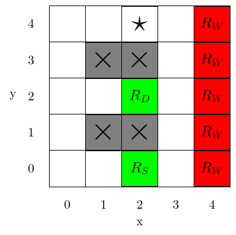
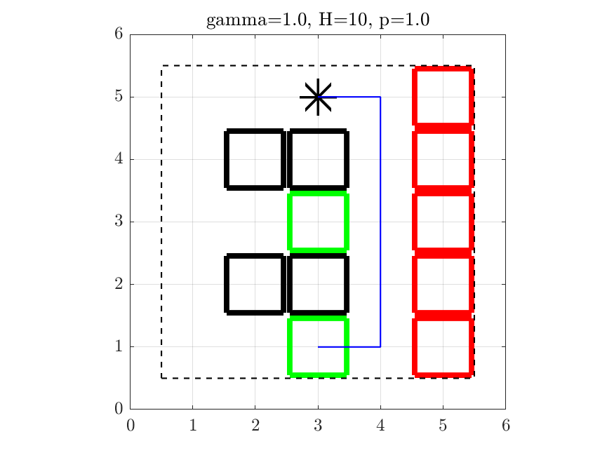
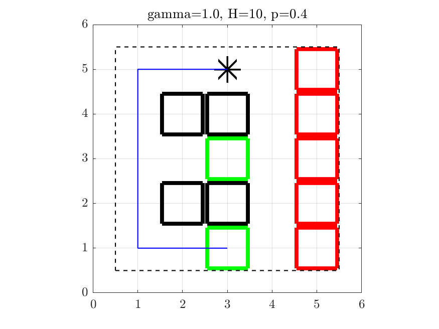
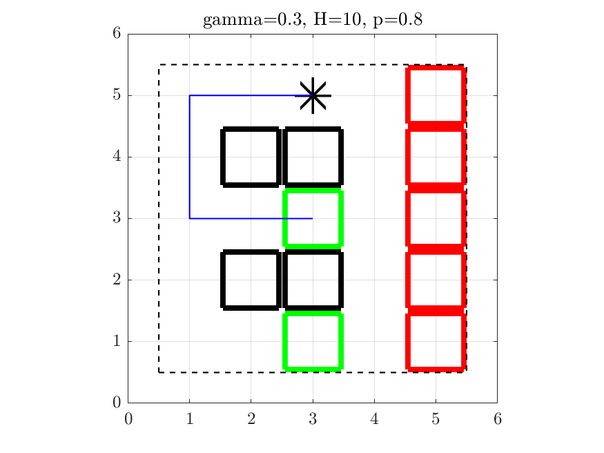

# Ice Cream Gridworld

Code repository for the ice cream gridworld problem (p2-1) for ECE 209AS F20 computational robotics at UCLA

Problem statement:
Consider the gridworld problem discussed in class, diagrammed below.  The system (with noisy gridworld dynamics) gets positive rewards $R_D, R_S$ for being in the two green ice cream store states, and negative reward $R_W$ for being in any red road state.
Formulate solve out a complete MDP problem, finding the optimal policy for a variety of task definitions.  Some questions to answer:

- How would we formulate a problem that ends with a one-time (discounted) reward $R_D$ or $R_S$ whenever the system is in the respective ice cream store state as an infinite time horizon problem?  What if the reward was not discounted?
- How instead would we formulate an infinite horizon, never-ending problem such that the system only achieves a reward upon entering the store rather than simply being in the store?
- How many different optimal trajectories can we find by changing just the task definition ($R_D, R_S, R_W, \gamma$), each starting at the $\star$?
- How do those trajectories / policies change as the system dynamics (error probabilities) change?
Under what conditions would it be an optimal strategy to visit both ice cream stores in the same trajectory?

## Approach

The gridworld is defined to be (5 x 5) according to the problem statement above. The state space is thus of dimension $N_\mathbb{S}=25$, $\mathbb{S} = \{s_i\},\;i = 1,\dots,25$. The action space is of dimension $N_\mathbb{A}=5$ where the possible actions are $\mathbb{A}=\{\text{stay}, \text{up}, \text{right}, \text{down}, \text{left}\}=\{a_j\},\;j = 1,...,5$.

The state transition probabilities assume a Bernoulli distribution where the probability that taking an action has the desired result is assigned probability $p$, and the remaining probability $1-p$ is assigned to the other outcomes. If an outcome results in an impossible state (e.g. moving into a wall or moving off of the gridworld), then that outcome's probability is added to the probability corresponding to $a = \text{stay}$.

The reward function is defined to be only a function of the state $s$, and not the action or next state. This means that the reward is assigned for being in an ice cream place.

The value iteration algorithm is as follows:
$$\begin{array}{ll}
\text{init} & V^*_0(s') \leftarrow 0 \\
& \pi^*_0(s) \leftarrow \text{random} \\
\mathop{\text{loop}}_i & Q_i(s,a) = \sum_{s'\in\mathbb{S}} p(s,a,s')\left[r(s,a,s') + \gamma V_i^*(s')\right] \\
& V^*_{i+1} = \max_a Q^*_i(s,a) \\
& \pi^*_{i+1} = \mathop{\text{arg\,max}}_a Q^*_i \\
\text{until} & i = H
\end{array}$$

## Files

`ice_cream.m` is the main script for this problem which defines all parameters, the the action space, the state transition probabilities, the reward function, the time horizon, and the discount factor, then runs a value iteration algorithm to generate an optimal policy. The policy is then used for a simulation and the results are plotted.

`xy_to_si.m` and `si_to_xy.m` are functions which map a coordinate pair $(x,y)$ into a certain state $s$.

## Results

The first plot shows the results for $\gamma=1$ (no discounting), $H=10$, and deterministic state transitions ($p=1$). The agent goes straight for the largest reward.

Decreasing the certainty that the action will have the desired result to $p=0.4$ causes the agent to avoid the road.

Changing the discount factor to $\gamma=0.3$ with a state transition certainty at $p=0.8$ causes the agent to dodge the road and stop at the first ice cream place. Increasing the certainty to $p=0.9$ causes the agent to walk next to the road.

